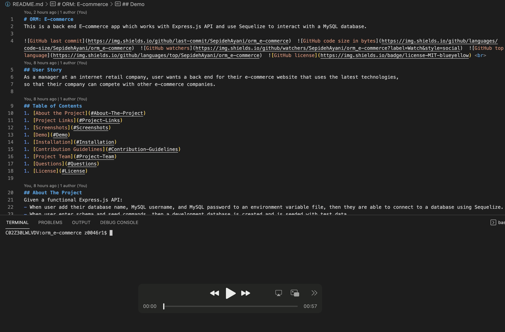

# ORM: E-commerce
This is a back end E-commerce app which works with Express.js API and use Sequelize to interact with a MySQL database.

         <br> 
## User Story
As a manager at an internet retail company, user wants a back end for their e-commerce website that uses the latest technologies,
so that their company can compete with other e-commerce companies.

## Table of Contents 
1. [About the Project](#About-The-Project)
1. [Project Links](#Project-Links)
1. [Screenshots](#Screenshots)
1. [Demo](#Demo)
1. [Installation](#Installation)
1. [Contribution Guidelines](#Contribution-Guidelines)
1. [Project Team](#Project-Team)
1. [Questions](#Questions)
1. [License](#License)

## About The Project
Given a functional Express.js API: 
- When user add their database name, MySQL username, and MySQL password to an environment variable file, then they are able to connect to a database using Sequelize.
- When user enter schema and seed commands, then a development database is created and is seeded with test data.
- When user enter the command to invoke the application, then their server is started and the Sequelize models are synced to the MySQL database.
- When user open API GET routes in Insomnia for categories, products, or tags, then the data for each of these routes is displayed in a formatted JSON.
- When user test API POST, PUT, and DELETE routes in Insomnia, then user is able to successfully create, update, and delete data in my database.

## Project Links
[Repo Link](https://github.com/SepidehAyani/orm_e-commerce) <br>

## Screenshots


## Demo
[](assets/demo.mp4)

## Instructions
```  
git clone https://github.com/SepidehAyani/orm_e-commerce.git
In the root directory of the project, run 'npm i' to download the dependencies.
Initiate the database with 'mysql -u root -p'.
To create tables, run 'source db/schema.sql'.
Exit the mysql terminal, and run 'npm run seed' to insert data into the tables.
Run 'npm start' to start your server.
```
#### Note: follow [this](https://flaviocopes.com/mysql-how-to-install/) to install MySql and setup your own username & password

## Languages and libraries used in this project:
- <a href="https://www.npmjs.com/">NPM</a>
- <a href="https://nodejs.org/">Node.js</a>
- <a href="https://www.npmjs.com/package/mysql2">MySQL2</a>
- <a href="https://sequelize.org/">Sequelize</a>
- <a href="https://www.npmjs.com/package/express">Express.js</a>
- <a href="https://www.npmjs.com/package/inquirer">Inquirer.js</a>

## Contribution Guidelines:
```  
Feel free to contribute to this repo by creating issues or sending an email to sepid.ayani@gmail.com
```

## Questions
<details>
    <summary>Contact</summary>
    sepid.ayani@gmail.com
</details>

## Project Team
[SepidehAyani](https://github.com/SepidehAyani) <br>

## License
#### Distributed under the MIT License. See [Choose A License](https://choosealicense.com/) for more details.